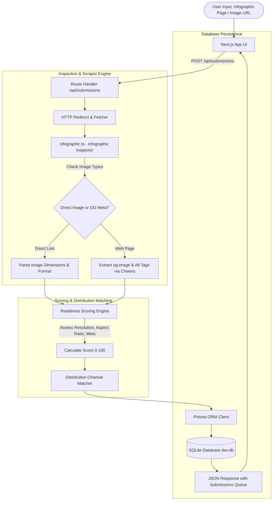

# vIS — Smarketers Infographic Submitter Architecture & Guide

> **Smarketers Off-Page Suite** — Local-first Next.js application that inspects, scores, and organizes public infographic URLs before off-page distribution, storing targets in a local SQLite database via Prisma ORM.

---

## 🏗️ System Architecture Overview



---

## 🔍 How Inspection & Channel Matching Works

### 1. Multi-Format Image Detection (`src/lib/infographic.ts`)
vIS inspects submitted URLs across two modes:
- **Direct Image Links**: Detects `.png`, `.jpg`, `.jpeg`, `.webp`, `.svg` files directly.
- **HTML Page Extraction**: Scans web pages for `og:image`, `twitter:image`, and high-resolution `` tags inside `<main>` or `<article>` tags.

### 2. Readiness Scoring Algorithm (0–100)
Scores visual assets across four criteria:
1. **Resolution & Clarity**: High-resolution images receive higher weights.
2. **Vertical Aspect Ratio**: Tall infographics (vertical ratio > 2:1) receive bonus readiness scores.
3. **Open Graph Completeness**: Validates presence of title, description, and canonical tags.
4. **Alt Text Optimization**: Evaluates descriptive alt text for search engine indexability.

### 3. Channel Distribution Matcher
Matches qualified infographics to top distribution platforms:
- **Pinterest** (Visual Discovery Network)
- **Visual.ly** (Curated Infographic Directory)
- **Infographic Bee** (Niche Visual Publishing)
- **Behance / Dribbble** (Design Showcase Outlets)

---

## 📊 Tech Stack

- **Framework**: Next.js 16 (App Router), React 19, TypeScript
- **Styling**: Tailwind CSS 4, shadcn/ui components, Lucide Icons, Sonner Toasts
- **Database & ORM**: Prisma 6 with local SQLite database
- **Validation**: Zod 3.x

---

## 🚀 Running Locally

```bash
# Install dependencies
npm install

# Run database migrations
npx prisma db push

# Run dev server
npm run dev

# Open in browser
http://localhost:3000
```

---

## 🌐 Part of Smarketers Off-Page Suite
vIS is part of the Smarketers Off-Page Suite — open-source, local-first marketing applications designed for privacy, speed, and reliability without SaaS dependencies.
